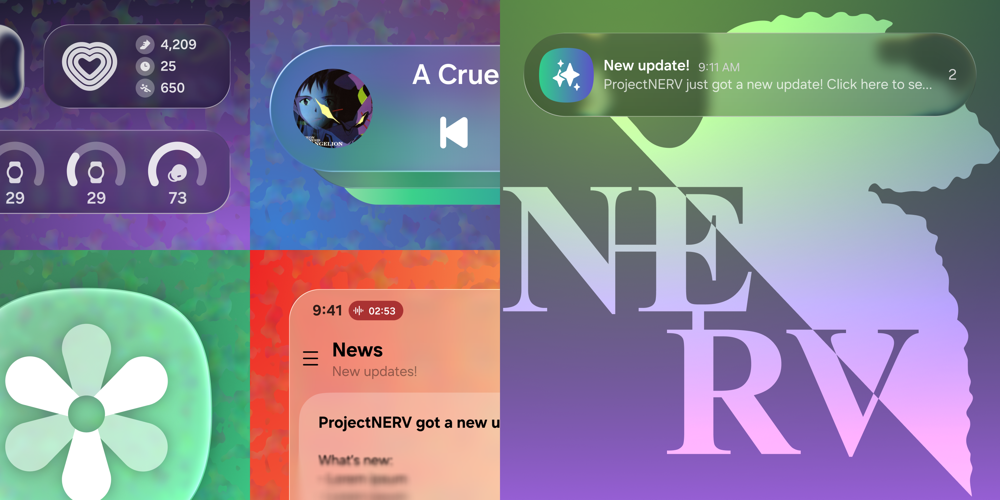

<h1 align="center">
  
</h1>

  
  
  
  
  

UN1CA <i>(/ˈu.ni.ka/)</i> is a work-in-progress custom firmware for Samsung Galaxy devices.

  <a href="https://t.me/unicarom">💬 UN1CA Telegram</a>

  <a href="https://t.me/SE_NERV">💬 NERV Telegram</a>

# What is UN1CA?
UN1CA is a work-in-progress custom firmware for Samsung Galaxy devices. It's based on the latest and greatest iteration of Samsung's UX and it also includes additional features and tweaks to ensure the best possible experience out of the box.
Its build system allows to automatically download/extract the firmware, apply the required patches and generates a flashable zip package for the specified device.

Any form of contribution, suggestions, bug report or feature request for the project will be welcome.

# What is NERV?
NERV is a fork of UN1CA; to make the build system work with One UI 7, we are aiming for an UN1CA-like experience with what we can do. All changes have been made under GPLv3, if you see any problems about credits at repo, please kindly report to me at Telegram, XDA or email. 

# Features
- Based on the latest Samsung devices firmware:
  - Galaxy S23 (Paradigm)
  - Galaxy S23 FE (Paradigm)
  - Galaxy A73 5G (Fun)
- Galaxy AI support
- App Lock Support
- High end animations
- Screenshots from Secure Apps support
- ASKS disabled 
- APK Downgrade support
- Native/live blur support (Paradigm)
- Adaptive refresh rate support (Paradigm)
- Extra brightness support
- Picture remaster support
- Object, shadow and reflection eraser support
- Image clipper support
- Smart Suggestions widget
- Samsung Now Brief support
- Multi user support
- Samsung DeX support (Paradigm)
- Camera privacy toggle support
- Debloated from useless system services/additional apps
- [BluetoothLibraryPatcher](https://github.com/3arthur6/BluetoothLibraryPatcher) included
- [KnoxPatch](https://github.com/salvogiangri/KnoxPatch) implemented in system frameworks

# Licensing
This project is licensed under the terms of the [GNU General Public License v3.0](LICENSE). External dependencies might be distributed under a different license, such as:
- [android-tools](https://github.com/nmeum/android-tools), licensed under the [Apache License 2.0](https://github.com/nmeum/android-tools/blob/master/LICENSE)
- [apktool](https://github.com/iBotPeaches/Apktool), licensed under the [Apache License 2.0](https://github.com/iBotPeaches/Apktool/blob/master/LICENSE.md)
- [erofs-utils](https://github.com/sekaiacg/erofs-utils/), dual license ([GPL-2.0](https://github.com/sekaiacg/erofs-utils/blob/dev/LICENSES/GPL-2.0), [Apache-2.0](https://github.com/sekaiacg/erofs-utils/blob/dev/LICENSES/Apache-2.0))
- [img2sdat](https://github.com/xpirt/img2sdat), licensed under the [MIT License](https://github.com/xpirt/img2sdat/blob/master/LICENSE)
- [platform_build](https://android.googlesource.com/platform/build/) (ext4_utils, f2fs_utils, signapk), licensed under the [Apache License 2.0](https://source.android.com/docs/setup/about/licenses)
- [smali](https://github.com/google/smali), [multiple licenses](https://github.com/google/smali/blob/main/third_party/NOTICE)

# Credits
A big thanks goes to the following for their invaluable contributions in no particular order:
- **[ShaDisNX255](https://github.com/ShaDisNX255)** for his help, time and for his [NcX ROM](https://github.com/ShaDisNX255/NcX_Stock) which inspired this project
- **[DavidArsene](https://github.com/DavidArsene)** for his help and time
- **[paulowesll](https://github.com/paulowesll)** for his help and support
- **[Simon1511](https://github.com/Simon1511)** for his support and some of the device-specific patches
- **[ananjaser1211](https://github.com/ananjaser1211)** for troubleshooting and his time
- **[iDrinkCoffee](https://github.com/iDrinkCoffee-TG)** and **[RisenID](https://github.com/RisenID)** for documentation revisioning
- **[LineageOS Team](https://www.lineageos.org/)** for their original [OTA updater implementation](https://github.com/LineageOS/android_packages_apps_Updater)
- **[Bobert10](https://t.me/bobert10)** for the NERV banner
- **[All Kangers]** for making me laugh with your rebranded repos with no difference
- *All the UN1CA project contributors and testers ❤️*

# Stargazers over time

